# 🚀 Task 4: Cloud Security Implementation using AWS

## 📌 Objective

To implement cloud security best practices by configuring IAM policies, secure storage, and data encryption on AWS.

---

## ☁️ Cloud Platform Used

* Amazon Web Services (AWS)
* IAM (Identity and Access Management)
* Amazon S3
* EC2 (Access validation testing)

---

## 🔐 1. IAM Policy Implementation

### 🎯 Goal

Apply the principle of least privilege by restricting user permissions.

### 🛠️ Implementation

* Created an IAM user with limited permissions.
* Did NOT assign administrative access.
* Attached **AmazonS3ReadOnlyAccess** policy via group.
* Tested access denial scenarios.

📷 Screenshot:
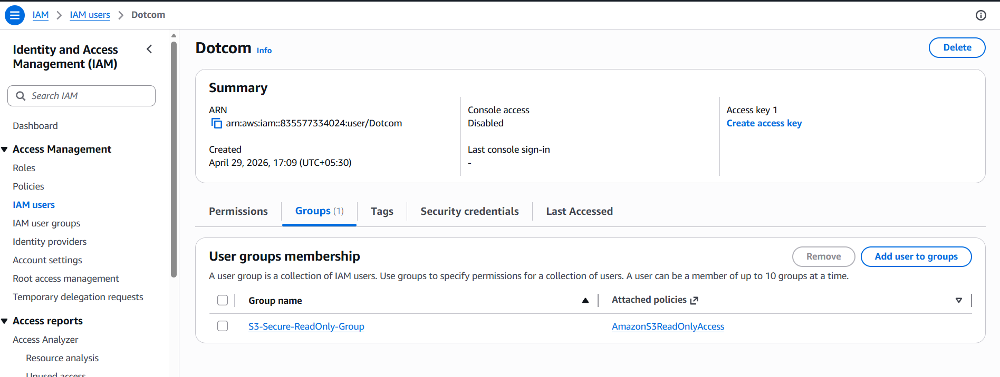

---

## 🪣 2. Secure Storage using Amazon S3

### 🎯 Goal

Ensure storage bucket is secure and not publicly accessible.

### 🛠️ Implementation

* Created an S3 bucket.
* Blocked all public access.
* Uploaded multiple test objects.

📷 Screenshots:
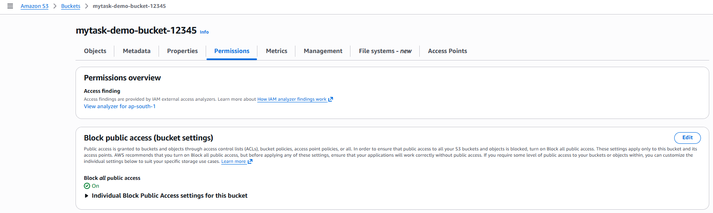
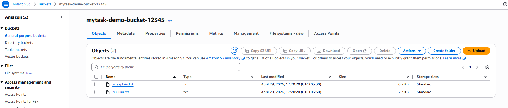

---

## 🔒 3. Data Encryption (Encryption at Rest)

### 🎯 Goal

Protect stored data using server-side encryption.

### 🛠️ Implementation

* Enabled default encryption on the S3 bucket.
* Used **SSE-S3 (AES-256)** encryption.
* Verified encryption status for each object.

📷 Screenshots:
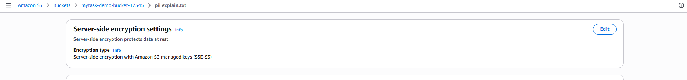
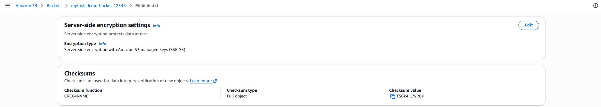

---

## 🧪 4. Access Control Validation (Security Testing)

To verify security controls, multiple access attempts were tested:

### ❌ Attempt 1: IAM User Delete Object

* User attempted to delete an object.
* Operation was denied.

📷 Screenshot:
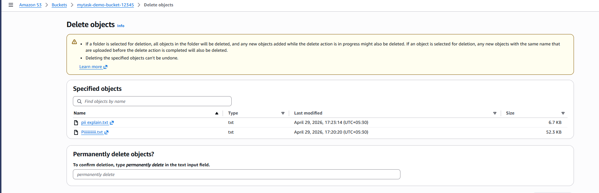

---

### ❌ Attempt 2: IAM User Upload Object

* User attempted to upload a file.
* Access was denied due to restricted permissions.

📷 Screenshot:
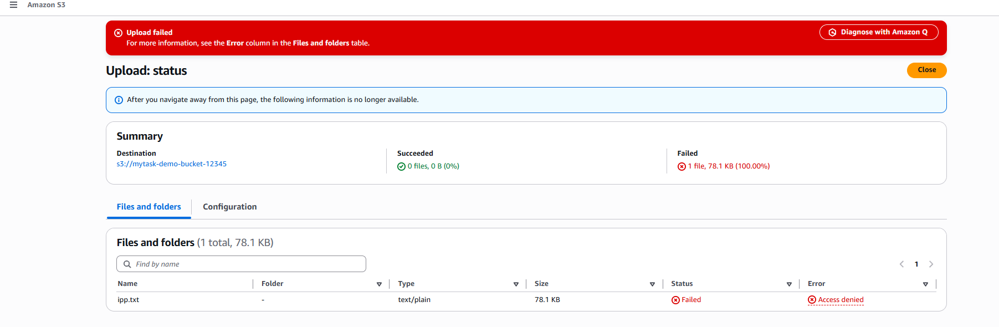

---

### ❌ Attempt 3: EC2 & IAM Dashboard Access

* Attempted to access AWS resources using IAM user.
* Access denied due to IAM restrictions.

📷 Screenshot:
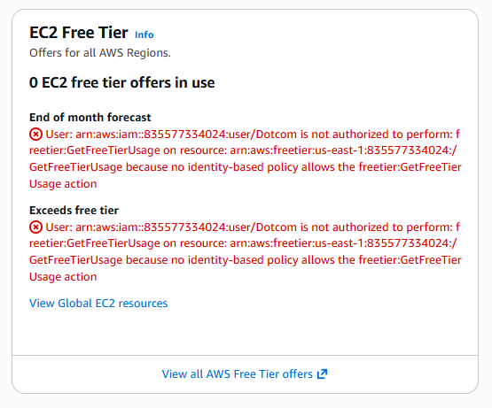

---

### ❌ Attempt 4: Public Access (Incognito Mode)

* Accessed S3 object URL in incognito browser.
* Access denied confirmed.
* Public access successfully blocked.

📷 Screenshots:
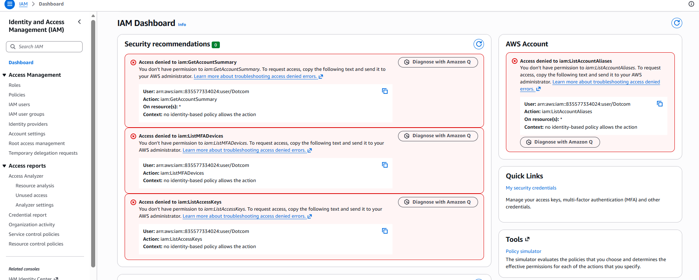
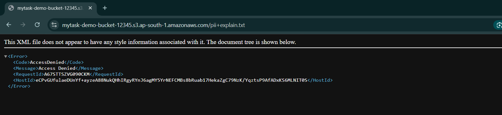
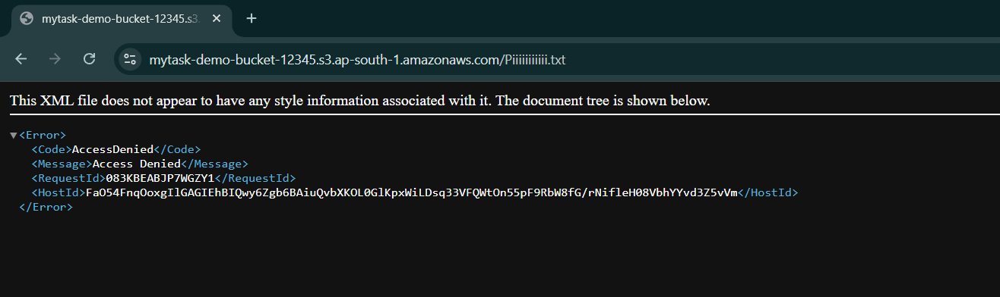

---

## 🗂️ 5. Versioning Enabled

### 🎯 Goal

Protect against accidental deletion or overwriting of files.

### 🛠️ Implementation

* Enabled versioning on the S3 bucket.
* Uploaded modified files to create multiple versions.
* Verified multiple versions of objects.

📷 Screenshot:
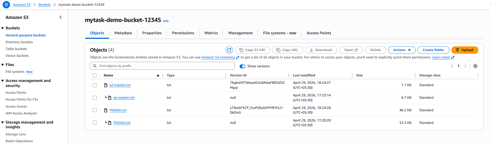

---

## 📊 Results

The cloud storage environment was successfully secured by:

* Implementing IAM-based access control
* Blocking public access
* Enforcing encryption at rest
* Validating restricted permissions
* Enabling versioning for data protection

All unauthorized access attempts were denied, confirming effective security configuration.

---

## ✅ Conclusion

This task demonstrates practical implementation of cloud security principles using AWS.
By applying IAM restrictions, secure storage configurations, encryption, and versioning, the cloud environment was protected against unauthorized access and data loss.

---
